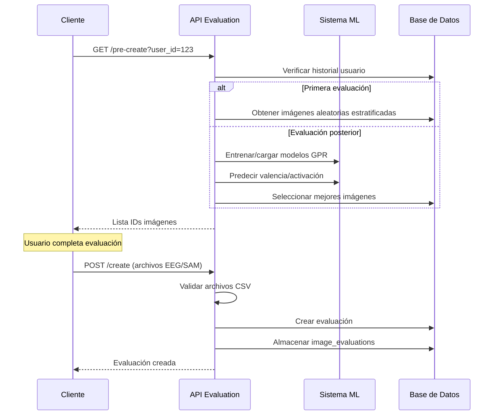

# API v2 - Evaluation

## Descripción General

La API de evaluación v2 gestiona el proceso completo de evaluación neurofisiológica del sistema EPRA, desde la preparación de sesiones hasta el análisis estadístico de resultados. Proporciona endpoints para la selección inteligente de estímulos visuales y el procesamiento de datos EEG/SAM.

## Endpoints Disponibles

### GET `/v2/evaluation/pre-create`

Selecciona imágenes para una sesión de evaluación basándose en el historial del usuario.

**Parámetros**:
- `user_id` (query, integer): ID del usuario
- `limit` (query, integer, opcional): Número de imágenes (≥5, default: 5)

**Respuesta**: Array de IDs de imágenes `[12, 45, 78, 123, 456]`

**Algoritmo de selección**:
- **Primera evaluación**: Selección aleatoria estratificada (al menos una imagen por nivel de violencia 0-4)
- **Evaluaciones posteriores**: Selección optimizada usando modelos GPR entrenados por usuario

### POST `/v2/evaluation/create`

Crea una nueva evaluación y procesa los archivos EEG y SAM asociados.

**Parámetros**:
- `user_id` (form): ID del usuario
- `eeg_file` (file): Archivo CSV con datos EEG procesados
- `sam_file` (file): Archivo CSV con respuestas SAM del usuario

**Respuesta**: Objeto evaluación creado con rutas de archivos almacenados

**Procesamiento**:
1. Valida formato de archivos CSV
2. Almacena archivos en estructura `/evaluations/{user_id}/{evaluation_id}/`
3. Crea registros en `image_evaluation` combinando datos EEG y SAM por posición

### GET `/v2/evaluation/list`

Lista todas las evaluaciones del sistema ordenadas cronológicamente.

**Respuesta**: Array de objetos evaluación con metadatos temporales

### GET `/v2/evaluation/stats`

Proporciona estadísticas agregadas de todos los usuarios.

**Respuesta**: Array con cantidad de evaluaciones por usuario
```json
[{"user_id": 123, "evaluation_quantity": 5}]
```

### GET `/v2/evaluation/stats/{user_id}`

Análisis detallado de un usuario específico incluyendo métricas de desviación SAM-EEG.

**Respuesta**: Estadísticas completas del usuario
```json
{
  "user_id": 123,
  "evaluation_quantity": 5,
  "emotion_stats": {
    "mean_valence_deviation": 1.2,
    "mean_arousal_deviation": 0.8,
    "systematic_bias": false
  },
  "evaluations": [...]
}
```

**Características**:
- Entrena automáticamente modelos GPR si no existen
- Incluye predicciones para cada evaluación histórica
- Calcula desviaciones y sesgos sistemáticos

## Flujo de Trabajo del Sistema



## Integración con el Modelo de Datos

Los endpoints utilizan las tablas documentadas en `Datos.md`:

- **`evaluation`**: Metadatos de sesiones y rutas de archivos
- **`image_evaluation`**: Datos detallados SAM/EEG por imagen
- **`image_classification`**: Vectores de características para predicciones ML

## Consideraciones para la Investigación

### Validez Experimental
- Aleatorización controlada en primera evaluación garantiza validez interna
- Selección adaptativa posterior permite estudios longitudinales
- Combinación de métricas subjetivas (SAM) y objetivas (EEG)

### Análisis Estadístico
- Detección automática de sesgos sistemáticos SAM vs EEG
- Métricas de desviación para análisis de consistencia intra-sujeto
- Datos estructurados para análisis multivariados
