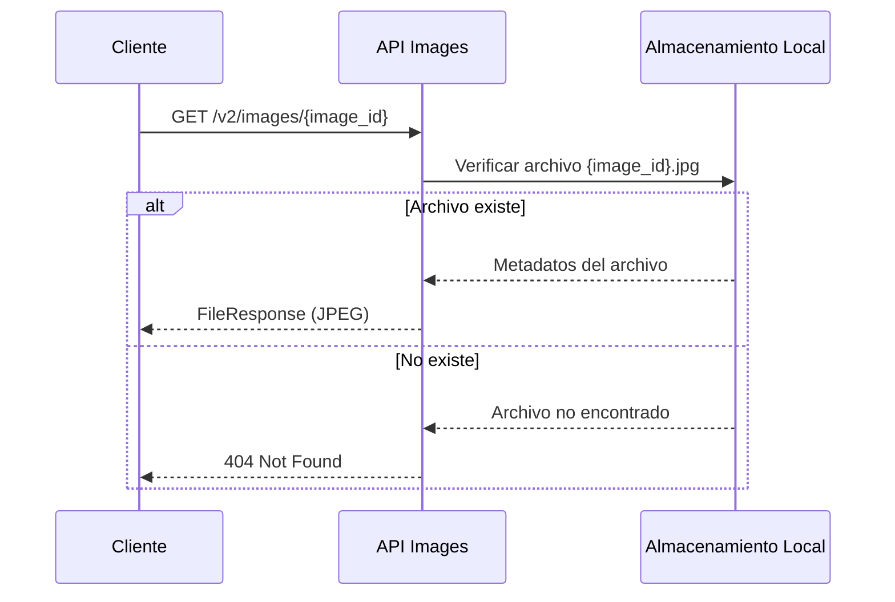

# API v2 - Images

## Descripción General

La API de imágenes v2 proporciona acceso a los estímulos visuales utilizados en las evaluaciones neurofisiológicas del sistema EPRA. Sirve imágenes clasificadas previamente por modelos de machine learning desde almacenamiento local.

## Endpoint Disponible

### GET `/v2/images/{image_id}`

Obtiene una imagen específica del sistema de almacenamiento local en formato JPEG.

**Parámetros**:
- `image_id` (path, integer): Identificador único de la imagen

**Respuesta**: Archivo de imagen en formato JPEG

**Errores**:
- `404`: Imagen no encontrada
- `422`: ID inválido (no entero)

## Implementación

### Flujo de Acceso

### Estructura de Almacenamiento
- **Directorio**: `images/`
- **Formato**: Solo JPEG
- **Nomenclatura**: `{image_id}.jpg`

## Integración con el Sistema

### Relación con Datos
- **`image_classification`**: Los `image_id` corresponden a imágenes clasificadas
- **Evaluaciones**: Imágenes utilizadas como estímulos en sesiones EEG
- **Conversión de tipos**: El endpoint acepta `integer` pero las referencias en BD pueden ser `TEXT`

### Consideraciones
- **Seguridad**: Validación automática de tipos, prevención de path traversal
- **Rendimiento**: Streaming directo de archivos, sin caché implementado
- **Formato único**: Solo JPEG, consistente con dataset de investigación
