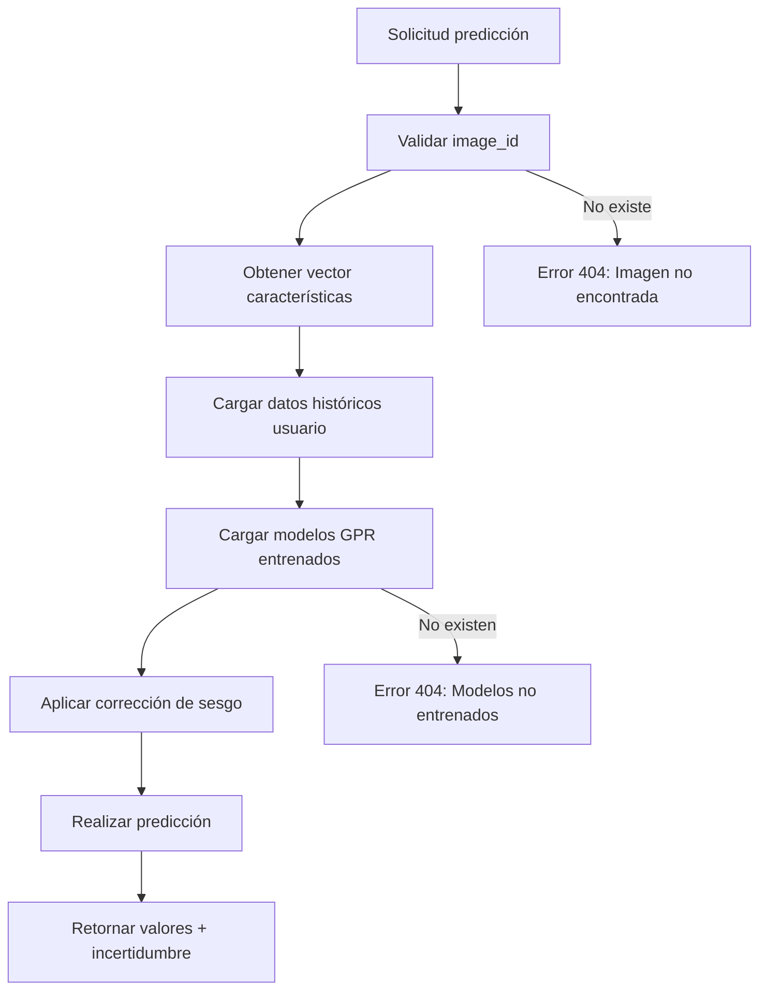

# API v2 - Predict

## Descripción General

La API de predicción v2 utiliza modelos de Gaussian Process Regression (GPR) entrenados específicamente por usuario para predecir respuestas emocionales (valencia y activación) a estímulos visuales. Implementa corrección de sesgo basada en datos históricos EEG/SAM para mejorar la precisión de las predicciones.

## Endpoint Disponible

### GET `/v2/predict`

Predice valores de valencia y activación para una imagen específica usando modelos personalizados del usuario.

**Parámetros**:
- `image_id` (query, integer): ID de la imagen para predecir
- `user_id` (query, integer): ID del usuario cuyos modelos utilizar

**Respuesta**: Predicciones con intervalos de confianza
```json
{
  "valence": 6.2,
  "valence_std": 0.8,
  "arousal": 7.1,
  "arousal_std": 1.2
}
```

**Características del modelo**:
- **Modelos personalizados**: GPR entrenados con datos históricos específicos del usuario
- **Corrección de sesgo**: Ajusta predicciones basándose en diferencias SAM vs EEG históricas
- **Intervalos de confianza**: Proporciona desviaciones estándar para análisis de incertidumbre
- **Validación**: Requiere modelos pre-entrenados y vector de características de la imagen

## Proceso de Predicción



## Integración con el Sistema

### Dependencias de Datos
- **`image_classification`**: Vector de características de la imagen objetivo
- **`image_evaluation`**: Datos históricos SAM/EEG del usuario para corrección de sesgo
- **Modelos GPR**: Archivos de modelos entrenados específicos por usuario

### Casos de Uso en Investigación
- **Validación de modelos**: Comparación de predicciones con respuestas reales
- **Selección de estímulos**: Identificación de imágenes con respuestas emocionales específicas
- **Análisis predictivo**: Evaluación de capacidad de generalización de modelos individuales

## Consideraciones Metodológicas

### Personalización
Los modelos GPR se entrenan individualmente por usuario, capturando patrones específicos de respuesta emocional y reduciendo variabilidad inter-sujeto.

### Corrección de Sesgo
El sistema ajusta automáticamente las predicciones usando datos históricos para compensar diferencias sistemáticas entre métricas subjetivas (SAM) y objetivas (EEG).

### Cuantificación de Incertidumbre
Las desviaciones estándar proporcionadas permiten análisis estadísticos robustos y evaluación de confiabilidad de predicciones individuales.


