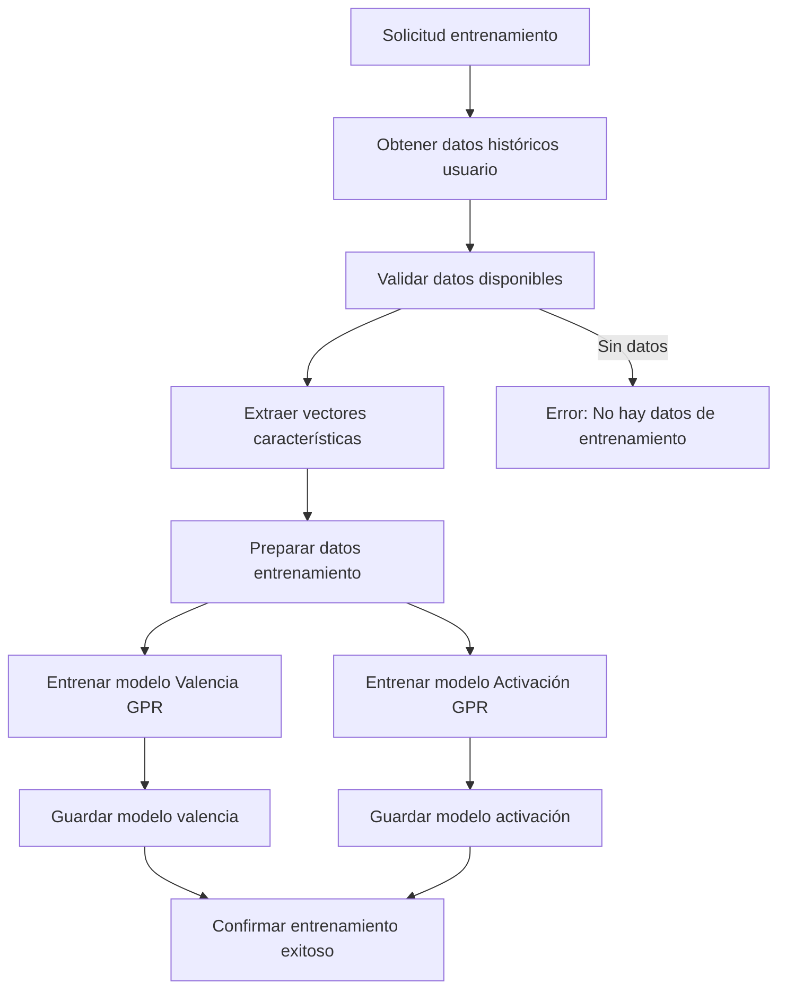

# API v2 - Train

## Descripción General

La API de entrenamiento v2 genera modelos de Gaussian Process Regression (GPR) personalizados por usuario para predecir respuestas emocionales. Utiliza datos históricos de evaluaciones EEG para entrenar modelos específicos de valencia y activación, habilitando predicciones personalizadas en el sistema EPRA.

## Endpoint Disponible

### POST `/v2/train/{user_id}`

Entrena modelos GPR de valencia y activación para un usuario específico usando sus datos históricos de evaluaciones.

**Parámetros**:
- `user_id` (path, integer): ID del usuario para entrenar modelos

**Respuesta**: Confirmación de entrenamiento exitoso
```
"Models trained for user 123"
```

**Requisitos**:
- El usuario debe tener al menos una evaluación completa en `image_evaluation`
- Cada evaluación debe tener vectores de características asociados en `image_classification`

## Proceso de Entrenamiento



## Características del Entrenamiento

### Datos de Entrada
- **Vectores de características**: Extraídos de imágenes clasificadas por modelo ML
- **Valores EEG objetivo**: Valencia y activación calculadas desde señales neurofisiológicas
- **Datos históricos**: Todas las evaluaciones previas del usuario específico

### Modelos Generados
1. **Modelo de Valencia**: Predice respuesta emocional en eje valencia (negativo-positivo)
2. **Modelo de Activación**: Predice respuesta emocional en eje activación (calma-excitación)

### Almacenamiento
- **Ubicación**: `/storage/models/user_{user_id}/`
- **Archivos**: `gpr_valence.joblib` y `gpr_arousal.joblib`
- **Formato**: Modelos serializados con joblib para carga posterior

## Integración con el Sistema

### Dependencias de Datos
- **`image_evaluation`**: Datos históricos SAM/EEG del usuario
- **`image_classification`**: Vectores de características de imágenes evaluadas
- **Join**: Combinación por `image_id` para crear dataset de entrenamiento

### Flujo en el Ecosistema EPRA
1. **Evaluaciones iniciales**: Usuario completa sesiones generando datos de entrenamiento
2. **Entrenamiento automático**: API train genera modelos personalizados
3. **Predicciones**: API predict utiliza modelos entrenados
4. **Selección optimizada**: API evaluation/pre-create usa predicciones para mejores estímulos

## Consideraciones Metodológicas

### Personalización de Modelos
Cada usuario tiene modelos únicos que capturan:
- Patrones individuales de respuesta emocional
- Variabilidad personal en valencia y activación
- Reducción de ruido inter-sujeto en predicciones

### Validación y Robustez
- **Datos mínimos**: Requiere evaluaciones previas para entrenamiento válido
- **Sobreescritura**: Cada entrenamiento actualiza modelos existentes
- **Consistencia**: Mantiene coherencia en estructura de datos y almacenamiento

### Aplicaciones en Investigación
- **Modelos adaptativos**: Permiten estudios longitudinales con estímulos personalizados
- **Análisis comparativo**: Evaluación de diferencias individuales en procesamiento emocional
- **Validación cruzada**: Comparación entre predicciones y respuestas reales futuras
