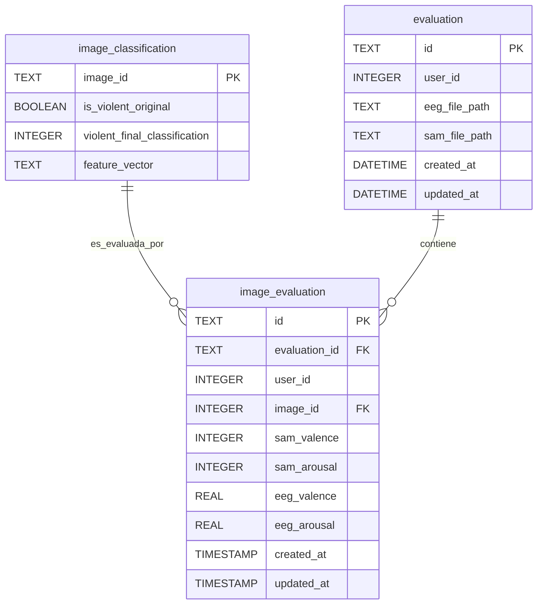

## Descripción Detallada de las Tablas

### 1. Tabla `image_classification` (Tabla Primaria del Sistema)

#### Propósito
Esta tabla constituye el punto de partida del sistema EPRA, almacenando los resultados del modelo de clasificación de violencia entrenado. Cada registro representa una imagen procesada por el modelo de machine learning que determina el nivel de violencia visual en una escala graduada de 0 a 4, junto con la clasificación binaria original y el vector de características utilizado para la toma de decisión.

#### Estructura de Datos

```sql
CREATE TABLE image_classification (
    image_id TEXT PRIMARY KEY,
    is_violent_original BOOLEAN NOT NULL,
    violent_final_classification INTEGER NOT NULL,
    feature_vector TEXT DEFAULT ''
);
```

#### Definición de Campos

| Campo | Tipo | Descripción | Restricciones |
|-------|------|-------------|---------------|
| `image_id` | TEXT | Identificador único de la imagen | PRIMARY KEY, INDEX |
| `is_violent_original` | BOOLEAN | Clasificación binaria original (violenta/no violenta) de la imagen | NOT NULL |
| `violent_final_classification` | INTEGER | Nivel de violencia graduado [0-4] determinado por el modelo de ML | NOT NULL, RANGE [0,4] |
| `feature_vector` | TEXT | Vector de características extraído de la imagen para decisión del modelo | DEFAULT '' |

#### Escala de Clasificación de Violencia

| Nivel | Descripción | Características |
|-------|-------------|-----------------|
| 0 | No violenta | Contenido pacífico, sin elementos agresivos |
| 1 | Violencia mínima | Indicios sutiles, tensión implícita |
| 2 | Violencia moderada | Elementos agresivos evidentes pero controlados |
| 3 | Violencia alta | Contenido explícitamente violento |
| 4 | Violencia extrema | Máximo nivel de contenido violento |

#### Consideraciones de Diseño

- **Tabla fundacional**: Primera en ser poblada, base para evaluaciones posteriores
- **Clasificación graduada**: Escala 0-4 permite análisis más granular que clasificación binaria
- **Vector de características**: Preserva el vector utilizado por el modelo para posterior entrenamiento de GPR
- **Trazabilidad del modelo**: Mantiene tanto clasificación original como refinada para validación
- **Serialización JSON**: Flexibilidad para vectores de dimensiones variables según arquitectura del modelo

### 2. Tabla `evaluation`

#### Propósito
Esta tabla representa las sesiones de evaluación principales, actuando como el contenedor de alto nivel para las evaluaciones EEG individuales realizadas por cada usuario.

#### Estructura de Datos

```sql
CREATE TABLE evaluation (
    id TEXT PRIMARY KEY,
    user_id INTEGER NOT NULL,
    eeg_file_path TEXT,
    sam_file_path TEXT,
    created_at DATETIME DEFAULT CURRENT_TIMESTAMP,
    updated_at DATETIME DEFAULT CURRENT_TIMESTAMP
);

CREATE INDEX idx_evaluation_user_id ON evaluation(user_id);
```

#### Definición de Campos

| Campo | Tipo | Descripción | Restricciones |
|-------|------|-------------|---------------|
| `id` | TEXT | Identificador único generado automáticamente (UUID4) | PRIMARY KEY |
| `user_id` | INTEGER | Identificador del usuario asociado a la evaluación | NOT NULL, INDEX |
| `eeg_file_path` | TEXT | Ruta del archivo EEG sin procesar cargado por el usuario | NULLABLE |
| `sam_file_path` | TEXT | Ruta del archivo de respuestas SAM (Self-Assessment Manikin) | NULLABLE |
| `created_at` | DATETIME | Timestamp de creación del registro | DEFAULT CURRENT_TIMESTAMP |
| `updated_at` | DATETIME | Timestamp de última actualización | DEFAULT CURRENT_TIMESTAMP |

#### Consideraciones de Diseño

- **Identificador UUID**: Garantiza unicidad global y evita colisiones en sistemas distribuidos
- **Índice en user_id**: Optimiza consultas frecuentes de evaluaciones por usuario
- **Rutas de archivos opcionales**: Permite evaluaciones en progreso sin archivos completos
- **Timestamps automáticos**: Facilita auditoría y trazabilidad temporal


### 3. Tabla `image_evaluation`

#### Propósito
Esta tabla constituye el núcleo del sistema, registrando las evaluaciones detalladas a nivel de imagen individual. Cada registro captura la asociación entre un usuario específico, un estímulo visual particular y las respuestas tanto subjetivas (escala SAM) como objetivas (métricas EEG calculadas).

#### Estructura de Datos

```sql
CREATE TABLE image_evaluation (
    id TEXT PRIMARY KEY,
    evaluation_id TEXT NOT NULL,
    user_id INTEGER NOT NULL,
    image_id INTEGER NOT NULL,
    sam_valence INTEGER NOT NULL,
    sam_arousal INTEGER NOT NULL,
    eeg_valence REAL NOT NULL,
    eeg_arousal REAL NOT NULL,
    created_at TIMESTAMP DEFAULT CURRENT_TIMESTAMP,
    updated_at TIMESTAMP DEFAULT CURRENT_TIMESTAMP
);

CREATE INDEX idx_image_evaluation_user_id ON image_evaluation(user_id);
```

#### Definición de Campos

| Campo | Tipo | Descripción | Restricciones |
|-------|------|-------------|---------------|
| `id` | TEXT | Identificador único del registro de evaluación de imagen (UUID4) | PRIMARY KEY |
| `evaluation_id` | TEXT | Referencia lógica a la sesión de evaluación principal | NOT NULL |
| `user_id` | INTEGER | Identificador del usuario asociado | NOT NULL, INDEX |
| `image_id` | INTEGER | Identificador del estímulo visual presentado | NOT NULL |
| `sam_valence` | INTEGER | Puntuación de valencia según escala SAM [1-9] | NOT NULL |
| `sam_arousal` | INTEGER | Puntuación de activación según escala SAM [1-9] | NOT NULL |
| `eeg_valence` | REAL | Valencia calculada automáticamente desde señales EEG | NOT NULL |
| `eeg_arousal` | REAL | Activación calculada automáticamente desde señales EEG | NOT NULL |
| `created_at` | TIMESTAMP | Timestamp de creación del registro | DEFAULT CURRENT_TIMESTAMP |
| `updated_at` | TIMESTAMP | Timestamp de última actualización | DEFAULT CURRENT_TIMESTAMP |

#### Consideraciones de Diseño

- **Evaluación dual**: Combina métricas subjetivas (SAM) y objetivas (EEG)
- **Granularidad por imagen**: Permite análisis detallado de respuestas específicas
- **Escalas normalizadas**: SAM utiliza escala estándar 1-9 para comparabilidad
- **Precisión EEG**: Valores flotantes para métricas neurofisiológicas precisas

## Relaciones Entre Tablas

### Modelo de Relaciones del Sistema EPRA

El sistema EPRA se estructura mediante un modelo relacional que conecta tres entidades principales: las imágenes clasificadas, las sesiones de evaluación y las evaluaciones individuales por imagen.

```
image_classification (1) ←→ (*) image_evaluation (*) ←→ (1) evaluation
```

### Diagrama Entidad-Relación



### Descripción de las Relaciones

#### 1. `image_classification` → `image_evaluation` (1:N)
- **Relación**: Una imagen clasificada puede ser evaluada múltiples veces por diferentes usuarios
- **Clave foránea**: `image_evaluation.image_id` → `image_classification.image_id` 
- **Cardinalidad**: 1:N (una imagen puede tener múltiples evaluaciones)
- **Propósito**: Conecta las imágenes pre-clasificadas por ML con las respuestas reales de los usuarios
- **Nota**: `image_classification.image_id` es TEXT, `image_evaluation.image_id` es INTEGER, requiere conversión en consultas

```sql
-- Relación implícita con conversión de tipos
-- CAST(image_evaluation.image_id AS TEXT) = image_classification.image_id
```

#### 2. `evaluation` → `image_evaluation` (1:N)
- **Relación**: Una sesión de evaluación contiene múltiples evaluaciones individuales de imágenes
- **Clave foránea**: `image_evaluation.evaluation_id` → `evaluation.id`
- **Cardinalidad**: 1:N (una evaluación contiene 5 evaluaciones de imágenes)
- **Propósito**: Agrupa las respuestas individuales de imágenes en sesiones completas

```sql
-- Relación implícita (sin FOREIGN KEY constraint por diseño)
-- image_evaluation.evaluation_id referencias evaluation.id
```

### Flujo de Datos del Sistema

#### Proceso de Evaluación por Usuario
1. **Sesión de Evaluación**: Se crea un registro en `evaluation` por cada sesión de usuario
2. **Selección de Imágenes**: El sistema selecciona 5 imágenes de `image_classification`
3. **Evaluación Individual**: Por cada imagen mostrada se crea un registro en `image_evaluation`
4. **Procesamiento EEG**: Las señales EEG se procesan para calcular valencia y activación
5. **Almacenamiento**: Se guardan tanto las respuestas SAM como las métricas EEG calculadas

#### Estructura Jerárquica
```
Usuario (user_id)
└── Sesión de Evaluación (evaluation)
    ├── Imagen 1 → image_evaluation (con datos SAM + EEG)
    ├── Imagen 2 → image_evaluation (con datos SAM + EEG)  
    ├── Imagen 3 → image_evaluation (con datos SAM + EEG)
    ├── Imagen 4 → image_evaluation (con datos SAM + EEG)
    └── Imagen 5 → image_evaluation (con datos SAM + EEG)
```

### Consideraciones de Integridad

#### Integridad Referencial
- **Sin constrains FK**: Las relaciones son lógicas, permitiendo flexibilidad en la carga de datos
- **Validación a nivel aplicación**: La integridad se mantiene mediante la lógica de negocio
- **Trazabilidad completa**: Cada evaluación mantiene referencias claras a sesión e imagen

#### Consistencia de Datos
- **image_id único**: Garantiza que cada imagen clasificada sea única en el sistema
- **evaluation_id por sesión**: Cada sesión tiene un identificador único UUID4
- **user_id consistente**: Mismo usuario a través de evaluation e image_evaluation

### Consultas Típicas del Sistema

#### Consulta de Evaluaciones por Usuario
```sql
SELECT 
    e.id as evaluation_id,
    e.created_at as session_date,
    ie.image_id,
    ic.violent_final_classification,
    ie.sam_valence, ie.sam_arousal,
    ie.eeg_valence, ie.eeg_arousal
FROM evaluation e
JOIN image_evaluation ie ON e.id = ie.evaluation_id  
JOIN image_classification ic ON CAST(ie.image_id AS TEXT) = ic.image_id
WHERE e.user_id = ?
ORDER BY e.created_at DESC, ie.created_at ASC;
```

#### Análisis de Respuestas por Nivel de Violencia
```sql
SELECT 
    ic.violent_final_classification,
    AVG(ie.sam_valence) as avg_sam_valence,
    AVG(ie.sam_arousal) as avg_sam_arousal,
    AVG(ie.eeg_valence) as avg_eeg_valence,
    AVG(ie.eeg_arousal) as avg_eeg_arousal,
    COUNT(*) as total_evaluations
FROM image_evaluation ie
JOIN image_classification ic ON CAST(ie.image_id AS TEXT) = ic.image_id
GROUP BY ic.violent_final_classification
ORDER BY ic.violent_final_classification;
```